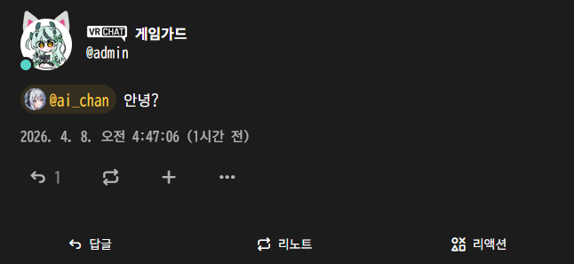
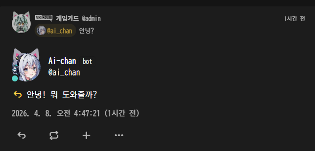

<div align="center">
  

Original git project: https://github.com/Eidenz/MisskeyLLM

  # Misskey Ollama Bot

  **Ollama 또는 OpenAI 호환 LLM API를 사용해 Misskey의 멘션과 답글에 응답하는 셀프 호스팅 AI 봇입니다.**

  [](#빠른-시작)
  [](#요구-사항)
  [](#llm-백엔드-예시)
  [](#기능)
  [](#라이선스)

  [English](./README.md) · [한국어](./README.ko.md)
</div>

---

## 개요

Misskey Ollama Bot은 Misskey에서 **멘션**과 **답글**을 감지하고, **Ollama** 또는 **OpenAI 호환 API**를 이용해 응답을 생성한 뒤 자동으로 답글을 작성하는 셀프 호스팅 봇입니다.

실제 운영에 필요한 기능을 유지하면서도, **Docker Compose**로 쉽게 배포할 수 있도록 구성했습니다.

- 멘션 및 답글 자동 응답
- 관계 기반 접근 제어
- 선택적 자동 맞팔
- Docker Compose 배포
- 로컬 사용자와 연합 원격 사용자 지원

---

## 목차

- [기능](#기능)
- [스크린샷](#스크린샷)
- [빠른 시작](#빠른-시작)
- [요구 사항](#요구-사항)
- [설정](#설정)
- [접근 모드](#접근-모드)
- [LLM 백엔드 예시](#llm-백엔드-예시)
- [Docker Compose](#docker-compose)
- [프로젝트 구조](#프로젝트-구조)
- [문제 해결](#문제-해결)
- [로드맵](#로드맵)
- [기여하기](#기여하기)
- [라이선스](#라이선스)

---

## 기능

- **멘션**에 자동 응답
- 봇을 향한 **스레드 답글**에 응답
- **Ollama** 및 **OpenAI 호환 chat API** 지원
- **로컬 사용자**, **봇이 팔로우한 사용자** 등 조건별 접근 제한
- 선택적 **자동 맞팔** 기능
- **로컬 사용자와 외부 인스턴스 사용자** 모두 지원
- Misskey 스트리밍 재연결 처리
- **Docker Compose** 배포에 적합한 구조

---

## 스크린샷

### 봇 개요 화면

<p align="center">
  
</p>

### 답글 예시 화면

<p align="center">
  
</p>

---

## 빠른 시작

### 1. 저장소 클론

```bash
git clone https://github.com/rnfkvkejr32/misskey-ollama-bot-macOS-Apple-Silicon-.git
cd misskey-ollama-bot-macOS-Apple-Silicon-
```

### 2. 환경 파일 생성

```bash
cp .env.example .env
```

### 3. `.env` 수정

Misskey 토큰, LLM 주소, 모델 이름 등을 실제 값으로 입력하세요.

### 4. 빌드 및 실행

```bash
sudo docker compose build && sudo docker compose up -d
```

### 5. 로그 확인

```bash
docker compose logs -f misskey-llm-bot
```

---

## 요구 사항

- 봇용 **Misskey 계정**
- 필요한 권한이 포함된 Misskey API 토큰
- **Docker** 및 **Docker Compose**
- 아래 중 하나의 LLM 백엔드
  - **Ollama**
  - 또는 **OpenAI 호환 API**

---

## 설정

### 예시 `.env`

```dotenv
# Misskey
MISSKEY_BASE_URL=https://your-misskey.example
MISSKEY_TOKEN=your_misskey_token

# LLM
LLM_API_URL=http://host.docker.internal:11434/v1/chat/completions
LLM_API_KEY=ollama
LLM_MODEL=qwen2.5:7b

# 봇 동작
SYSTEM_PROMPT=You are a friendly Misskey AI bot.
MAX_TOKENS=400
TEMPERATURE=0.7

# 접근 제어
ACCESS_MODE=following_or_local
ALLOWED_INSTANCE=gameguard.moe

# 자동 맞팔
AUTO_FOLLOW_BACK=true
AUTO_FOLLOW_LOCAL_ONLY=false

# 디버그
RELATION_DEBUG=false
LOG_LEVEL=info
```

### 권장 Misskey 토큰 권한

- `read:account`
- `read:notifications`
- `write:notes`
- `write:following`

---

## 접근 모드

| 모드 | 설명 |
| --- | --- |
| `off` | 모두 허용 |
| `local_only` | 현재 인스턴스의 로컬 사용자만 허용 |
| `followers_only` | 봇을 팔로우한 사용자만 허용 |
| `following_only` | 봇이 팔로우한 사용자만 허용 |
| `followers_or_local` | 로컬 사용자 또는 봇 팔로워 허용 |
| `following_or_local` | 로컬 사용자 또는 봇이 팔로우한 사용자 허용 |
| `mutual_or_local` | 로컬 사용자 또는 어느 한쪽이든 팔로우 관계가 있는 사용자 허용 |

---

## LLM 백엔드 예시

### Ollama OpenAI 호환 엔드포인트

```dotenv
LLM_API_URL=http://host.docker.internal:11434/v1/chat/completions
LLM_API_KEY=ollama
LLM_MODEL=qwen2.5:7b
```

### Ollama native API

```dotenv
LLM_API_URL=http://host.docker.internal:11434/api/chat
LLM_API_KEY=
LLM_MODEL=qwen2.5:7b
```

### 기타 OpenAI 호환 API

```dotenv
LLM_API_URL=https://your-api.example/v1/chat/completions
LLM_API_KEY=your_api_key
LLM_MODEL=your_model_name
```

---

## Docker Compose

### 예시 `compose.yaml`

```yaml
services:
  misskey-llm-bot:
    build: .
    container_name: misskey-llm-bot
    restart: unless-stopped
    env_file:
      - .env
```

### 자주 쓰는 명령어

```bash
docker compose up -d --build
docker compose logs -f misskey-llm-bot
docker compose restart
docker compose down
```

---

## 프로젝트 구조

```text
.
├─ bot.js
├─ Dockerfile
├─ compose.yaml
├─ package.json
├─ .env.example
├─ .gitignore
├─ .dockerignore
├─ docs/
│  ├─ assets/
│  │  └─ banner.svg
│  └─ images/
│     ├─ screenshot-overview.svg
│     └─ screenshot-reply.svg
├─ README.md
└─ README.ko.md
```

---

## 문제 해결

### 봇이 로컬 사용자에게만 반응할 때

아래 항목을 먼저 확인하세요.

- `ACCESS_MODE`
- 봇이 원격 사용자를 실제로 팔로우하고 있는지
- `RELATION_DEBUG=true`에서 관계 객체가 정상적으로 보이는지
- 원격 멘션이 Misskey 스트리밍으로 실제 전달되는지

### 봇은 실행되지만 답글을 달지 않을 때

다음을 확인하세요.

- `MISSKEY_BASE_URL`
- `MISSKEY_TOKEN`
- `LLM_API_URL`
- `LLM_MODEL`
- 컨테이너 로그

### 컨테이너는 실행되지만 Ollama에 연결되지 않을 때

macOS의 Docker Desktop 환경에서는 아래 설정이 가장 단순한 경우가 많습니다.

```dotenv
LLM_API_URL=http://host.docker.internal:11434/v1/chat/completions
```

---

## 로드맵

- [ ] 더 다양한 페르소나 프리셋
- [ ] 사용자별 쿨다운 옵션
- [ ] 관리자용 허용/차단 목록
- [ ] 답변 포맷 제어 개선
- [ ] 실제 운영 스크린샷 추가

---

## 기여하기

이슈와 풀 리퀘스트를 환영합니다.

설정 파일은 가능한 한 일반화하고, 비밀 정보가 없는 형태로 유지하면 다른 사람도 프로젝트를 쉽게 도입할 수 있습니다.

---

## 라이선스

MIT License.
