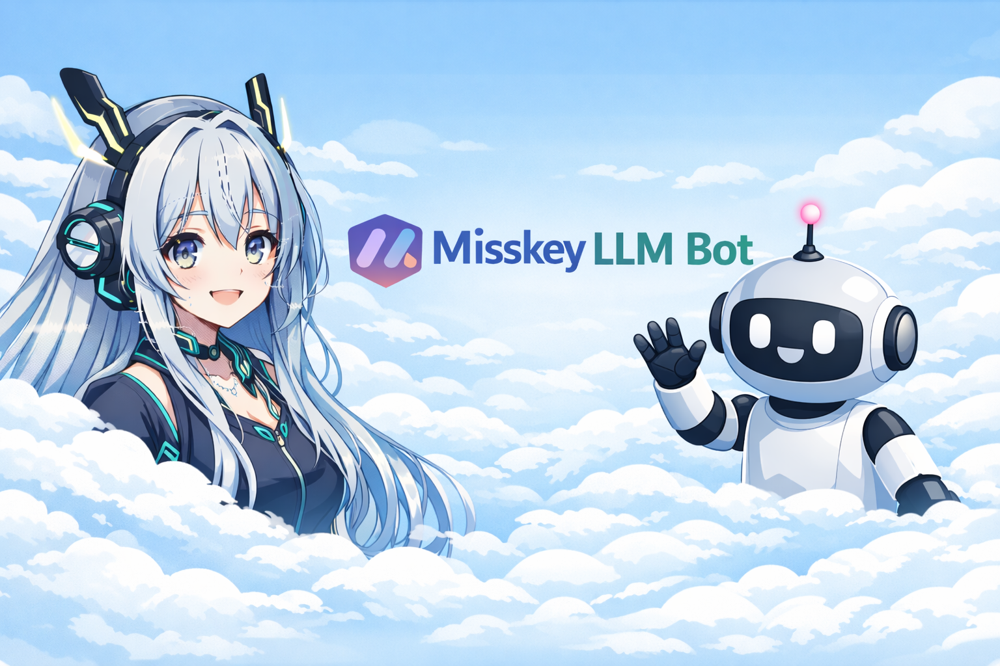
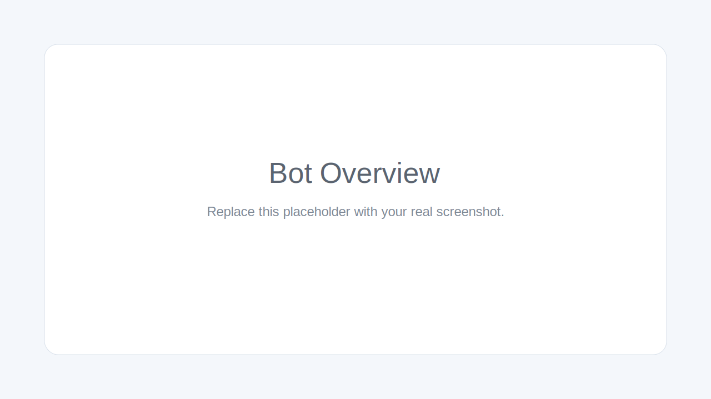

<p align="center">
  
</p>

<p align="center">
  <strong>Misskey LLM Bot</strong><br>
  Ollama/OpenAI 호환 텍스트 답변과 선택적 ComfyUI 이미지 생성을 지원하는 셀프 호스팅 Misskey 봇입니다.
</p>

<p align="center">
  <a href="./README.md">English</a>
</p>

## 개요

Misskey Ollama Bot은 Misskey의 멘션과 답글을 감지하고, Ollama 또는 OpenAI 호환 API로 텍스트 응답을 생성하며, 필요할 경우 외부 ComfyUI Desktop 인스턴스를 통해 이미지까지 생성할 수 있는 셀프 호스팅 봇입니다.

데모용이 아니라 실제 운영을 염두에 두고 구성되어 있으며, 다음 기능을 지원합니다.

- 멘션 및 답글 처리
- 로컬 및 연합된 외부 인스턴스 사용자 대응
- 관계 기반 접근 제어
- 자동 맞팔
- Docker Compose 배포
- Apple Silicon 친화적 호스트 워크플로
- 선택적 ComfyUI 이미지 생성
- 이미지 답글의 안전한 공개 범위 보정 (`public -> home`)

## 주요 기능

- Misskey 멘션에 자동으로 답변
- 봇을 대상으로 한 스레드 답글 처리
- Ollama 및 OpenAI 호환 텍스트 API 지원
- 외부 ComfyUI Desktop을 통한 선택적 이미지 생성
- 로컬 및 외부 연합 인스턴스 사용자 지원
- 관계 기반 접근 제어
- 선택적 자동 맞팔
- 안정적인 WebSocket 재연결 처리
- Docker Compose 배포 지원
- 이미지 답글 공개 범위 안전 처리
  - `public -> home`
  - `home -> home`
  - `followers -> followers`
  - `specified -> specified`

## 스크린샷

### 프로젝트 배너

저장소 메인 페이지에 사용하는 배너 이미지입니다.

<p align="center">
  
</p>

### 봇 개요

저장소 개요 예시 이미지입니다.

<p align="center">
  
</p>

### 답글 예시

멘션/답글 흐름 예시 이미지입니다.

<p align="center">
  
</p>

## 프로젝트 구조

```text
.
├─ bot.js
├─ package.json
├─ compose.yaml
├─ Dockerfile
├─ .env.example
├─ workflows/
│  └─ anima_preview3_qwen_txt2img_api.json
└─ docs/
   ├─ assets/banner.png
   └─ images/
```

## 요구 사항

- Docker Engine + Compose
- Misskey 봇 토큰
- Ollama 또는 다른 OpenAI 호환 텍스트 API
- 이미지 생성을 사용할 경우 호스트에서 실행 중인 ComfyUI Desktop

## 빠른 시작

1. 예시 환경 파일을 복사합니다.

```bash
cp .env.example .env
```

2. `.env`를 수정합니다.

텍스트 전용 최소 예시:

```dotenv
MISSKEY_BASE_URL=https://misskey.example.com
MISSKEY_TOKEN=put_your_misskey_token_here
LLM_API_URL=http://host.docker.internal:11434/v1/chat/completions
LLM_API_KEY=ollama
LLM_MODEL=qwen2.5:7b
ENABLE_IMAGE_GENERATION=false
```

ComfyUI 이미지 생성 예시:

```dotenv
MISSKEY_BASE_URL=https://misskey.example.com
MISSKEY_TOKEN=put_your_misskey_token_here
LLM_API_URL=http://host.docker.internal:11434/v1/chat/completions
LLM_API_KEY=ollama
LLM_MODEL=qwen2.5:7b

ENABLE_IMAGE_GENERATION=true
COMFYUI_BASE_URL=http://host.docker.internal:8000
COMFYUI_WORKFLOW_FILE=/app/workflows/anima_preview3_qwen_txt2img_api.json
COMFYUI_DIFFUSION_MODEL=anima-preview3-base.safetensors
COMFYUI_TEXT_ENCODER=qwen_3_06b_base.safetensors
COMFYUI_VAE=qwen_image_vae.safetensors
```

3. 빌드하고 실행합니다.

```bash
docker compose up -d --build
```

4. 로그를 확인합니다.

```bash
docker compose logs -f misskey-llm-bot
```

## ComfyUI 관련 안내

이 저장소에는 ComfyUI 자체가 포함되어 있지 않습니다.  
호스트에서 별도로 실행 중인 ComfyUI Desktop에 연결하는 방식입니다.

보통 컨테이너에서는 아래 주소로 접근합니다.

```text
http://host.docker.internal:8000
```

포함된 workflow는 다음 Anima Preview3 조합을 기준으로 작성되어 있습니다.

- `anima-preview3-base.safetensors`
- `qwen_3_06b_base.safetensors`
- `qwen_image_vae.safetensors`

Compose 파일에는 `./workflows`를 컨테이너의 `/app/workflows`로 마운트하는 설정이 들어 있어 workflow 수정이 편합니다.

## 명령 예시

텍스트 답변:
```text
@bot 안녕?
```

이미지 생성:
```text
@bot /img 푸른 하늘을 나는 고래
@bot /image 밤의 유리 온실
@bot /그림 별이 가득한 겨울 숲
```

## 접근 제한

`.env`의 `ACCESS_MODE`로 설정합니다.

지원 모드:

- `off`
- `local_only`
- `followers_only`
- `following_only`
- `followers_or_local`
- `following_or_local`
- `mutual_or_local`

예시:

```dotenv
ACCESS_MODE=following_or_local
ALLOWED_INSTANCE=misskey.example.com
```

## 자동 맞팔

자동 맞팔 활성화:

```dotenv
AUTO_FOLLOW_BACK=true
```

같은 인스턴스 사용자에게만 자동 맞팔:

```dotenv
AUTO_FOLLOW_LOCAL_ONLY=true
```

## 참고

- 일반 텍스트 답글은 기본적으로 원본 visibility를 상속합니다.
- 생성된 이미지 답글은 더 넓어지지 않도록 안전하게 보정됩니다.
- `.env`는 Git에 올리지 않는 것이 좋습니다.
- Docker 명령에 `sudo`가 필요하면 앞에 붙여서 실행하면 됩니다.

## 라이선스

MIT. 자세한 내용은 [LICENSE](./LICENSE)를 참고하세요.

## 원본 기반

자세한 내용은 [UPSTREAM.md](./UPSTREAM.md)를 참고하세요.
