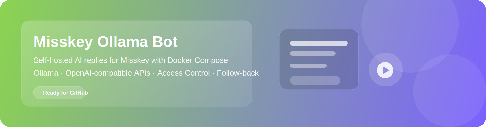

<div align="center">
  

  # Misskey Ollama Bot

  **A self-hosted AI reply bot for Misskey powered by Ollama or any OpenAI-compatible LLM API.**

  [](#quick-start)
  [](#requirements)
  [](#llm-backend-examples)
  [](#features)
  [](#license)

  [English](./README.md) · [한국어](./README.ko.md)
</div>

---

## Overview

Misskey Ollama Bot is a simple self-hosted bot that watches for **mentions** and **replies** on Misskey, generates a response with **Ollama** or any **OpenAI-compatible API**, and posts the result back automatically.

It is built for practical self-hosting, with features such as:

- mention and reply handling
- relationship-based access control
- optional auto follow-back
- Docker Compose deployment
- support for both local and remote Misskey users

---

## Table of Contents

- [Features](#features)
- [Screenshots](#screenshots)
- [Quick Start](#quick-start)
- [Requirements](#requirements)
- [Configuration](#configuration)
- [Access Modes](#access-modes)
- [LLM Backend Examples](#llm-backend-examples)
- [Docker Compose](#docker-compose)
- [Project Structure](#project-structure)
- [Troubleshooting](#troubleshooting)
- [Roadmap](#roadmap)
- [Contributing](#contributing)
- [License](#license)

---

## Features

- Replies to **mentions** automatically
- Replies to **thread replies** aimed at the bot
- Supports **Ollama** and **OpenAI-compatible chat APIs**
- Can restrict usage to **local users**, **followed users**, or both
- Optional **auto follow-back**
- Works with **local and federated remote users**
- Handles **Misskey streaming reconnects** gracefully
- Designed for **Docker Compose** deployment

---

## Screenshots

### Bot Overview

<p align="center">
  
</p>

### Reply Example

<p align="center">
  
</p>

---

## Quick Start

### 1. Clone the repository

```bash
git clone https://github.com/rnfkvkejr32/misskey-ollama-bot-macOS-Apple-Silicon-.git
cd misskey-ollama-bot-macOS-Apple-Silicon-
```

### 2. Create your environment file

```bash
cp .env.example .env
```

### 3. Edit `.env`

Fill in your Misskey token, LLM endpoint, and model name.

### 4. Build and run

```bash
sudo docker compose build && sudo docker compose up -d
```

### 5. Check logs

```bash
docker compose logs -f misskey-llm-bot
```

---

## Requirements

- A **Misskey** account for the bot
- A Misskey API token with the required permissions
- **Docker** and **Docker Compose**
- One LLM backend:
  - **Ollama**
  - or an **OpenAI-compatible API**

---

## Configuration

### Example `.env`

```dotenv
# Misskey
MISSKEY_BASE_URL=https://your-misskey.example
MISSKEY_TOKEN=your_misskey_token

# LLM
LLM_API_URL=http://host.docker.internal:11434/v1/chat/completions
LLM_API_KEY=ollama
LLM_MODEL=qwen2.5:7b

# Bot behavior
SYSTEM_PROMPT=You are a friendly Misskey AI bot.
MAX_TOKENS=400
TEMPERATURE=0.7

# Access control
ACCESS_MODE=following_or_local
ALLOWED_INSTANCE=gameguard.moe

# Auto follow-back
AUTO_FOLLOW_BACK=true
AUTO_FOLLOW_LOCAL_ONLY=false

# Debug
RELATION_DEBUG=false
LOG_LEVEL=info
```

### Recommended Misskey token permissions

- `read:account`
- `read:notifications`
- `write:notes`
- `write:following`

---

## Access Modes

| Mode | Description |
| --- | --- |
| `off` | Allow everyone |
| `local_only` | Allow only local users from your instance |
| `followers_only` | Allow only users who follow the bot |
| `following_only` | Allow only users followed by the bot |
| `followers_or_local` | Allow local users or bot followers |
| `following_or_local` | Allow local users or users followed by the bot |
| `mutual_or_local` | Allow local users or users connected by either follow direction |

---

## LLM Backend Examples

### Ollama via OpenAI-compatible endpoint

```dotenv
LLM_API_URL=http://host.docker.internal:11434/v1/chat/completions
LLM_API_KEY=ollama
LLM_MODEL=qwen2.5:7b
```

### Ollama via native API

```dotenv
LLM_API_URL=http://host.docker.internal:11434/api/chat
LLM_API_KEY=
LLM_MODEL=qwen2.5:7b
```

### Other OpenAI-compatible APIs

```dotenv
LLM_API_URL=https://your-api.example/v1/chat/completions
LLM_API_KEY=your_api_key
LLM_MODEL=your_model_name
```

---

## Docker Compose

### Example `compose.yaml`

```yaml
services:
  misskey-llm-bot:
    build: .
    container_name: misskey-llm-bot
    restart: unless-stopped
    env_file:
      - .env
```

### Common commands

```bash
docker compose up -d --build
docker compose logs -f misskey-llm-bot
docker compose restart
docker compose down
```

---

## Project Structure

```text
.
├─ bot.js
├─ Dockerfile
├─ compose.yaml
├─ package.json
├─ .env.example
├─ .gitignore
├─ .dockerignore
├─ docs/
│  ├─ assets/
│  │  └─ banner.svg
│  └─ images/
│     ├─ screenshot-overview.svg
│     └─ screenshot-reply.svg
├─ README.md
└─ README.ko.md
```

---

## Troubleshooting

### The bot only replies to local users

Check these first:

- `ACCESS_MODE`
- whether the bot actually follows the remote user
- whether `RELATION_DEBUG=true` shows a valid relation object
- whether the remote mention reaches the bot through Misskey streaming

### The bot starts but never posts a reply

Check:

- `MISSKEY_BASE_URL`
- `MISSKEY_TOKEN`
- `LLM_API_URL`
- `LLM_MODEL`
- container logs

### The container runs but Ollama is unreachable

For Docker Desktop on macOS, this is often the simplest option:

```dotenv
LLM_API_URL=http://host.docker.internal:11434/v1/chat/completions
```

---

## Roadmap

- [ ] Add richer persona presets
- [ ] Optional per-user cooldowns
- [ ] Optional admin allow/block list
- [ ] Better message formatting controls
- [ ] Example screenshots from a live deployment

---

## Contributing

Issues and pull requests are welcome.

If you plan to publish improvements, keeping configuration generic and secret-free makes the project easier for others to adopt.

---

## License

MIT License.
